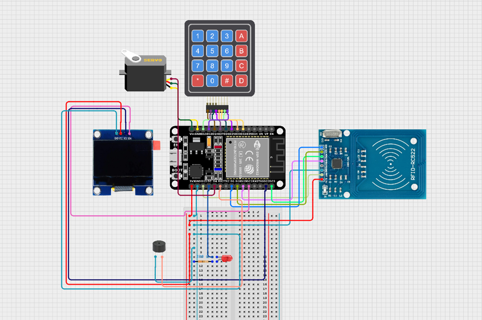

Hi my name is Zeynep Meryem Sertgöz who have university number of 20240808508. And this is my CSE328 lecture project.

In this project, I aimed to do a smart door system that can be opened with both RFID card and keypad. Prioritising security and user experience, will be developed using ESP32 development board. In correct entrances, the door will open and close with a servo motor in synchronisation with a short music ‘like dancing’ and will make a fun welcome. In case of wrong entries, the buzzer will provide a security warning by sounding a siren and red led will turn on. Oled is for understanding keypad entries. And the best thing is this whole system connected to the Telegram and Arduino cloud, we can see a alert message about the wrong entries. Also we can control the door thru Telegram. And in cloud we can count which person enter how many times.

